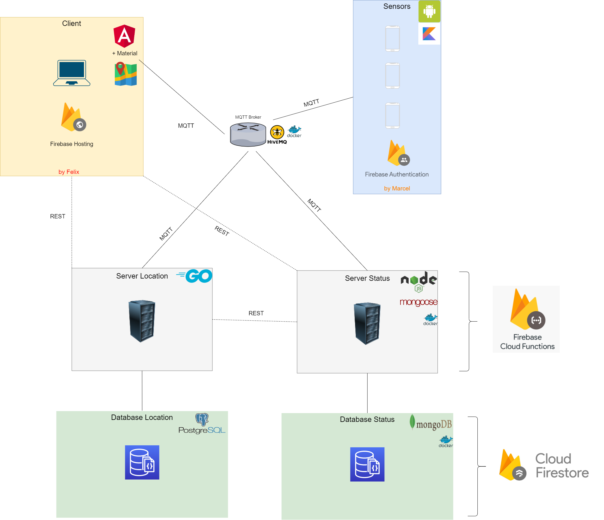

# PolizeiLeitstelle
Zentrale Leistelle für Polizei in Oberösterreich. Sie verfügt über eine Liste, die alle Polizeiautos besitzt (mit deren Status)  
Wenn es einen Einsatz in dem Bezirk Eferding gibt, kann sich die Leitstelle alle verfügbaren Autos (in dem jeweiligen Bezirk) anzeigen lassen und an eines der Fahrzeuge den Einsatz schicken.  
Das Polizeiauto bekommt den Einsatz und kann diesen dann mit der Statusmeldung 3 (annehmen/übernehmen) akzeptieren.  
Während des Einsatzes kann das Auto weitere Statusmeldungen schicken, z.B. eingetroffen.
Wenn das Auto den Status wieder auf 1 (Einsatzbereit stellt), ist demzufolge der Einsatz vorbei und es kann den Nächsten bearbeiten.

# Erweiterung

### MQTT Hierarchy
* Leitstelle
  * \<Bezirk\>
    * \<AutoID\>
      * Einsatz
      * Status

### Status
1:	EB (Einsatzbereit)  
2:	bed. EB (bedingt Einsatzbereit)  
3:	annehmen/übernehmen  
4:	eingetroffen  
5:	Sprechwunsch  
6:	Bereithaltezet  
7:	abmelden  
8:	Sprechwunsch in anderem Bundesland

#### Bezirke  
BR (Braunau am Inn)  
EF (Eferding)  
FR (Freistadt)  
GM (Gmunden)  
GR (Grieskirchen)  
KI (Kirchdorf)  
L (Linz)  
LL (Linz-Land)  
PE (Perg)  
RI (Ried im Innkreis)  
RO (Rohrbach)  
SD (Schärding)  
SR (Steyr)  
SE (Steyr-Land)  
UU (Urfahr-Umgebung)  
VB (Vöcklabruck)  
WE (Wels)  
WL (Wels-Land)

#### JSON format
* Einsatz  
{"id": "value", "description": "value"}

* Status  
{"statusId": "value", "description": "value"}  

#### System Architecture  
  

