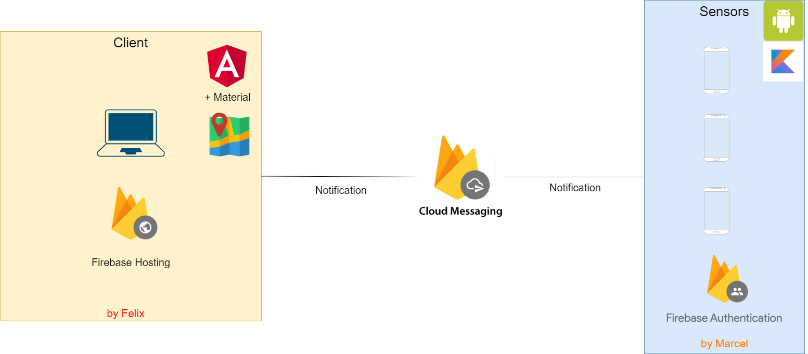

# Erweiterung
Es werden die aktuellen Positionen der einzelnen Autos angezeigt. Man kann sich die letzten paar Positionen für ein Auto anzeigen lassen, in Form einer Route. Auch kann man sich für einen Einsatz die Route des Autos anzeigen lassen. Alle Positionen werden in einer Datenbank gespeichert und die Positionen werden nicht simuliert, sondern man kann mit der Handy-App herumfahren und es werden die aktuellen GPS-Daten geschickt.

### MQTT Hierarchy
* Leitstelle
  * \<Bezirk\>
    * \<AutoID\>
      * GPS

#### JSON format
* GPS-Daten  
{"x-coordinate": "value", "y-coordinate": "value"}

#### System Architecture  
  

